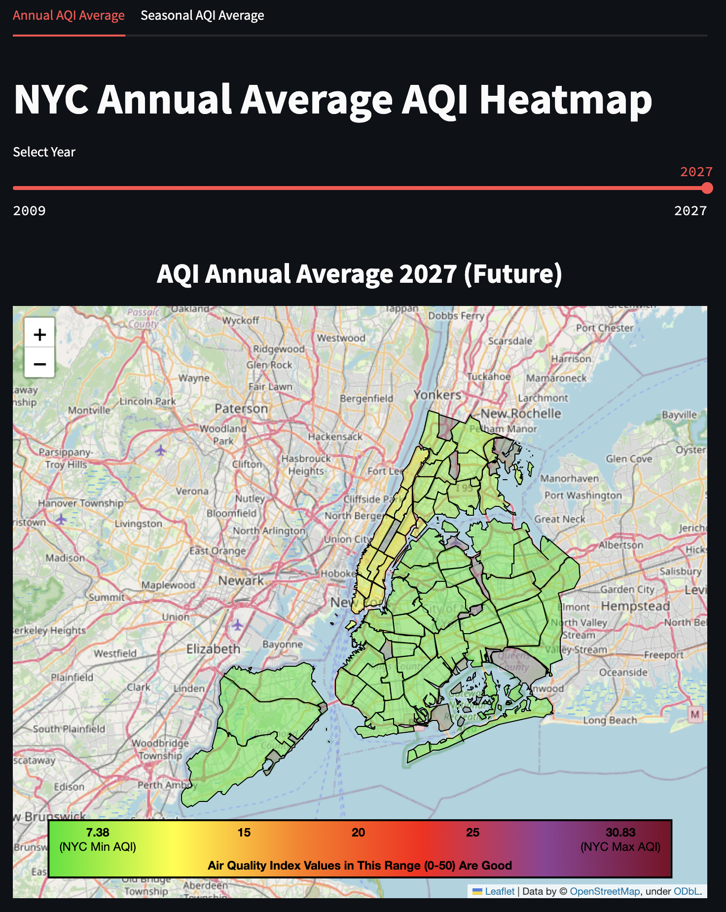
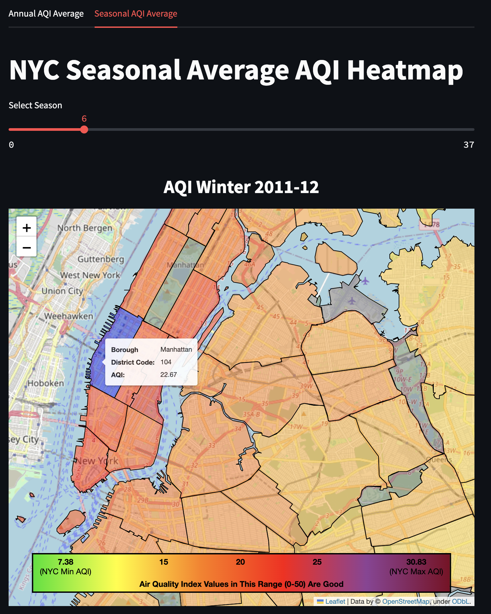
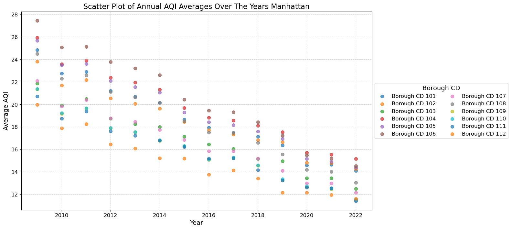

# nyc-air-quality-heat-map-predictor

## Usage

Application for displaying past and predicted future values of the air quality index (AQI) over New York City's five borough district communities. 

## Introduction

Air pollution poses significant risks to both the environment and public health. In the summer of 2023, New York City's skyline turned orange due to smoke from Canadian wildfires, highlighting the importance of monitoring air quality. Although this dataset only extends through 2022, it provides valuable insights into the city's air quality trends as well as predicted values to 2027.

On average, New York City's AQI remains below 50, placing it in the "Good" category. However, certain high-traffic areas, such as Midtown, often experience elevated PM2.5 levels compared to surrounding regions, which can lead to localized pollution concerns. To visualize the contrast between boroughs more effectively, a custom RGB color interpolation function was applied with the low and high bounds of the colors reflecting the respective lowest and highest average AQI values in the dataset.

The average AQI was calculated for each of the boroughs' air pollutants for the given seasons/years. The pollutants analyzed include:

- Fine particles (PM 2.5)
- Nitrogen dioxide (NO2)
- Ozone (O3)

The AQI calculations performed in this application follow the May 2024 EPA Air Quality Reporting Document: [View the PDF](resources/EPA/technical-assistance-document-for-the-reporting-of-daily-air-quailty.pdf)

## Dataset Used

This dataset contains the name of the airborne pollutant, time and place of measurement, as well as the average value of the measurement. 

Dataset source: [NYC Open Data AQI](https://data.cityofnewyork.us/Environment/Air-Quality/c3uy-2p5r/about_data)

This dataset was last updated in April of 2024.

## Example User Interface

NYC's annual average air quality index for the year 2009. The distribution of AQI values highlights regions with varied air quality, indicating both better and worse air quality zones.

NYC's future annual average air quality index for the year 2027. The averages here reflect changes in the air quality over the years as compared to 2009. 

Close up showing the AQI for given the borough code in the winter.

## Linear Regression (Prediction Model)

This project involves predicting future Air Quality Index (AQI) averages using a linear regression model. The model is trained on historical annual and seasonal AQI averages, categorized by borough community district codes. This approach allows us to forecast AQI values for each borough code based on historical trends.

### Model Training and Prediction

- **Data**: The model uses AQI data over multiple years, segmented by borough community district codes. The dataset includes both annual and seasonal averages.
  
- **Training**: The linear regression model was trained on the historical AQI data. The downward trend observed in the dataset helps the model make informed predictions.

- **Prediction Horizon**: Due to the ongoing downward trend, the model can reliably predict AQI averages up to the next 5 years. Beyond this period, accuracy may decline as the dataset does not show a tapering off in AQI values.

### Visualization

A scatter plot illustrating the downward trend for Manhattan's borough codes is shown below. This visualization helps to understand the trend and validate the model's predictions.

### Model Performance

The model's performance is evaluated based on its ability to predict future AQI values accurately. As the dataset shows a consistent trend without a tapering effect, predictions remain reliable within the next 5 years.
